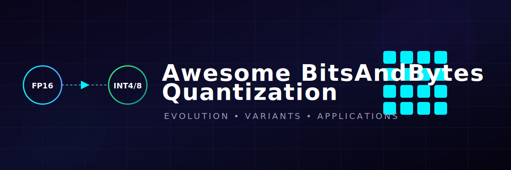
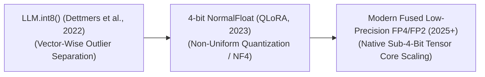

  

<meta name="description" content="A curated resource list and guide on BitsAndBytes quantization, covering NF4, FP4, LLM.int8(), paged optimizers, and local fine-tuning methodologies." />
<meta name="keywords" content="BitsAndBytes, Quantization, QLoRA, LLM, deep learning, PyTorch, model compression, NF4, FP4, LLM.int8()" />

# 🚀 Awesome BitsAndBytes Quantization 🧠

## 📉 BitsAndBytes Quantization: Evolution, Variants, Types, & Applications

**BitsAndBytes Quantization** is an industry-standard, hardware-aware model compression framework designed to accelerate the training and deployment of deep learning architectures, particularly Large Language Models (LLMs) [1]. Developed by Tim Dettmers, the library introduces custom low-level CUDA kernels that compress standard high-precision floating-point weights (like FP32 or BF16) into dynamic 8-bit or 4-bit representations. Unlike traditional quantization methods that frequently corrupt model reasoning due to systemic parameters outliers, BitsAndBytes isolates these fragile channels, permitting developers to load massive models on consumer-grade hardware or execute parameter-efficient fine-tuning (PEFT) with absolute zero performance degradation.

---

## 1. ⏳ The Chronological Evolution

The technical progression of the BitsAndBytes library reflects a steady trajectory away from rigid integer rounding to outlier-isolated tensor splitting and highly specialized non-uniform data types.

| Era / Concept | Description | Year | First Used Paper |
| :--- | :--- | :--- | :--- |
| [**The Vector-Wise Outlier Separation Era (LLM.int8())**](details/llm_int8_separation.md) | **Concept:** The core foundational breakthrough. Dettmers et al. discovered that transformer layers contain a small set of dominant, high-magnitude activation channels (outliers) that absorb massive amounts of semantic weight. Standard 8-bit quantization ruined models because it clipped these outliers. `LLM.int8()` solved this by splitting the matrix multiplication: 99.9% of normal features are quantized to 8-bit integers, while the 0.1% outlier vectors are held in raw, high-precision FP16.  **Significance:** Unlocked zero-degradation 8-bit inference for multi-billion parameter models, entirely removing the accuracy penalty typical of early integer quantization. | 2022 | [LLM.int8(): 8-bit Matrix Multiplication for Transformers at Scale](https://arxiv.org/abs/2208.07339) |
| [**The 4-bit NormalFloat & Quantization Double Play (QLoRA)**](details/qlora_double_quant.md) | **Concept:** Engineered specifically to scale down post-training fine-tuning. Introduced the **4-bit NormalFloat (NF4)** data type, an information-theoretically optimal non-uniform quantization scheme designed for normally distributed weight parameters. It coupled this with **Double Quantization (DQ)** to compress the scale constants generated during the primary compression pass.  **Significance:** Formed the backbone of QLoRA, permitting engineers to fine-tune a massive 70B parameter network on a single, consumer-grade 48GB GPU block. | 2023 | [QLoRA: Efficient Finetuning of Quantized LLMs](https://arxiv.org/abs/2305.14314) |
| [**The Native Sub-4-Bit & Fused Floating-Point Era**](details/sub4bit_fused_fp.md) | **Concept:** The modern state-of-the-art framework. BitsAndBytes expanded past basic integer formats to support natively accelerated, non-uniform micro-floating-point formats, including **FP4** and **FP2** configurations tailored directly for advanced GPU architectures (such as NVIDIA Blackwell architectures). | 2023 | [Microscaling data formats for deep learning](https://arxiv.org/abs/2310.10562) |

---

## 2. 🎛️ Core Functional & Data-Type Variants

The BitsAndBytes ecosystem is organized around specialized low-bit data types designed to balance model weight density with mathematical representational fidelity.

| Variant | Mechanism & Pros | Year | First Used Paper |
| :--- | :--- | :--- | :--- |
| [**LLM.int8() (Mixed-Precision 8-bit)**](details/llm_int8_variant.md) | **Mechanism:** A vector-wise quantization scheme. It sets a strict numerical threshold (typically $\ge 6.0$). If an activation channel crosses this limit, it is segregated and executed in high-precision floating-point formats, while standard coordinates scale cleanly into 8-bit integers. | 2022 | [LLM.int8(): 8-bit Matrix Multiplication for Transformers at Scale](https://arxiv.org/abs/2208.07339) |
| [**4-bit NormalFloat (NF4)**](details/nf4_variant.md) | **Mechanism:** Constructs a non-uniform mathematical quantile grid. Because neural network weights naturally follow a zero-centered Gaussian distribution, NF4 spaces out the 16 available quantization bins such that every individual bin holds an equal expected number of parameter weights.  **Pros:** Significantly higher information density and information retention than standard 4-bit integers (INT4) or uniform 4-bit floats (FP4). | 2023 | [QLoRA: Efficient Finetuning of Quantized LLMs](https://arxiv.org/abs/2305.14314) |
| [**4-bit Floating-Point (FP4)**](details/fp4_variant.md) | **Mechanism:** A uniform 4-bit floating-point layout containing a dedicated sign bit, exponent bits, and mantissa fields (e.g., E2M1 or E1M2 configurations).  **Pros:** Natively supported by newer corporate data center GPUs, enabling massive tensor core acceleration without requiring dynamic software transformations. | 2023 | [QLoRA: Efficient Finetuning of Quantized LLMs](https://arxiv.org/abs/2305.14314) |

---

## 3. ⚙️ System-Level Hardware & Optimization Classes

Depending on the operational constraints of the ML infrastructure, BitsAndBytes injects specialized system layers to protect gradient updates and manage physical VRAM ceilings.

| Class | Mechanism & Significance | Year | First Used Paper |
| :--- | :--- | :--- | :--- |
| [**Dynamic Quantization on-the-fly (Inference/Forward Pass)**](details/dynamic_quant.md) | **Mechanism:** To protect arithmetic precision, model weights are stored statically on disk in 4-bit or 8-bit formats. During the actual forward-pass matrix multiplication, the compressed parameters are dynamically unrolled and de-quantized back into FP16 or BF16 vectors inside the GPU's fast, on-chip SRAM registers before execution. | 2022 | [LLM.int8(): 8-bit Matrix Multiplication for Transformers at Scale](https://arxiv.org/abs/2208.07339) |
| [**Paged Optimizers (Unified Memory Swapping)**](details/paged_optimizers.md) | **Mechanism:** Integrates with NVIDIA Unified Memory drivers to manage parameter-efficient fine-tuning states. If the training batch encounters a massive activation spike or long context extension that crosses the physical GPU memory ceiling, it automatically pages memory blocks over to host CPU RAM over the PCIe bus.  **Significance:** Acts as a mandatory safety rail, preventing catastrophic Out-Of-Memory (OOM) crashes during fine-tuning routines. | 2023 | [QLoRA: Efficient Finetuning of Quantized LLMs](https://arxiv.org/abs/2305.14314) |

---

## 4. ⚠️ Production Engineering Challenges & Mitigations

Deploying and scaling BitsAndBytes configurations across scalable production nodes introduces unique latency and software integration constraints.

| Challenge | Problem & Mitigation | Year | First Used Paper |
| :--- | :--- | :--- | :--- |
| [**The Real-Time De-Quantization Latency Overhead**](details/dequant_latency.md) | **The Problem:** Because weights must be dynamically de-quantized from 4-bit/8-bit back to floating-point formats inside VRAM during every single operational layer step, the framework introduces minor runtime computational latency, occasionally slowing down token generation speed compared to pure, uncompressed high-precision inference.  **Mitigation:** Restricting BitsAndBytes usage strictly to **memory-bandwidth-bound environments** (such as low-concurrency edge systems or long-context fine-tuning) where loading massive tensors from slow memory dominates overall clock cycles, making raw compression a net win. | 2023 | [QLoRA: Efficient Finetuning of Quantized LLMs](https://arxiv.org/abs/2305.14314) |
| [**The Device Matrix Compatibility Boundary**](details/device_compatibility.md) | **The Problem:** BitsAndBytes relies on low-level, highly custom handwritten CUDA C++ compilation blocks. If deployed onto alternative, non-NVIDIA execution clusters (such as AMD ROCm nodes or Apple Silicon chips), the library crashes or defaults to unoptimized execution graphs.  **Mitigation:** Porting configurations through open-standard compiler abstraction layers like **OpenAI Triton-backed BitsAndBytes forks** or Hugging Face `optimum` pipelines. | 2021 | [8-bit Optimizers via Block-wise Quantization](https://arxiv.org/abs/2110.02861) |

---

## 5. 🔮 Frontier Real-World AI Applications

| Application | Description | Year | First Used Paper |
| :--- | :--- | :--- | :--- |
| [**Consumer-Grade Local Fine-Tuning Hubs (LoRA / QLoRA)**](details/local_finetuning.md) | Serves as the default optimization backend for tools like Axolotl, Unsloth, and Hugging Face PEFT. Independent developers and corporate engineers wrap base foundation architectures (e.g., Llama 3 70B) with 4-bit NF4 configurations, executing complex post-training alignment sprints locally on standard server nodes or high-end consumer cards. | 2023 | [QLoRA: Efficient Finetuning of Quantized LLMs](https://arxiv.org/abs/2305.14314) |
| [**Multi-Tenant SaaS Foundation Serving Hubs**](details/saas_serving.md) | Optimizes cloud serving frameworks. Inference servers store massive foundation networks compressed via BitsAndBytes 4-bit hooks to fit multiple model instances inside a single physical VRAM cluster, dynamically swapping tiny, specialized downstream adapter weights to route multi-user traffic cheaply. | 2023 | [Punica: Multi-Tenant LoRA Serving](https://arxiv.org/abs/2310.18547) |
| [**Edge Device Decentralized Intelligence (Local LLM Serving)**](details/edge_serving.md) | Running advanced reasoning profiles locally on enterprise hardware or mobile nodes. BitsAndBytes compression drops model memory boundaries down into shared unified system RAM lines, permitting continuous chat generation without relying on external cloud APIs or data networks. | 2022 | [LLM.int8(): 8-bit Matrix Multiplication for Transformers at Scale](https://arxiv.org/abs/2208.07339) |

##  Star History

<a href="https://www.star-history.com/?repos=ishandutta2007%2FAwesome-BitsAndBytes-Quantization&type=date&legend=bottom-right">
<picture>
<source media="(prefers-color-scheme: dark)" srcset="https://api.star-history.com/chart?repos=ishandutta2007/Awesome-BitsAndBytes-Quantization&type=date&theme=dark&legend=bottom-right" />
<source media="(prefers-color-scheme: light)" srcset="https://api.star-history.com/chart?repos=ishandutta2007/Awesome-BitsAndBytes-Quantization&type=date&legend=bottom-right" />

</picture>
</a>

