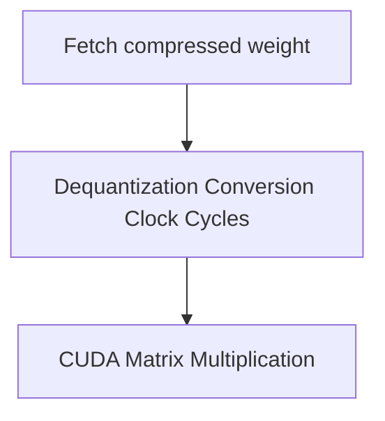

# The Real-Time De-Quantization Latency Overhead

[← Back to README](../README.md)

## Introduction
While quantization reduces model storage size, the requirement to dynamically dequantize weights back to floating point formats during inference introduces de-quantization latency overhead.

## How it Works
The GPU spends extra clock cycles unpacking and converting 4-bit or 8-bit formats back to FP16 before executing CUDA kernels.

## Significance
- Requires careful optimization in latency-sensitive applications.
- More beneficial in memory-bandwidth-bound tasks rather than compute-bound tasks.
