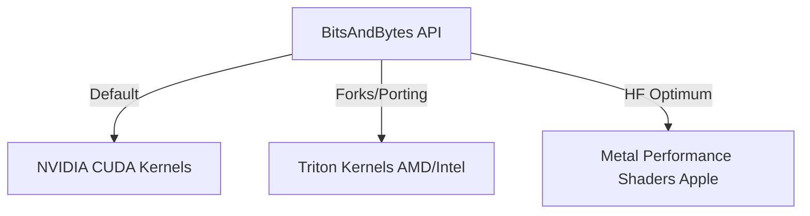

# The Device Matrix Compatibility Boundary

[← Back to README](../README.md)

## Introduction
The Device Matrix Compatibility Boundary refers to the hardware and compiler compatibility constraints of the bitsandbytes library, which was originally compiled and optimized exclusively for NVIDIA CUDA platforms.

## How it Works
Low-level operations utilize hand-written CUDA C++ assembly files. To run on AMD, Apple, or Intel hardware, custom compilation pipelines and runtime backends are required.

## Significance
- Standard bitsandbytes requires NVIDIA hardware.
- Multi-device compatibility is actively addressed by the community through Triton and Optimum integrations.
