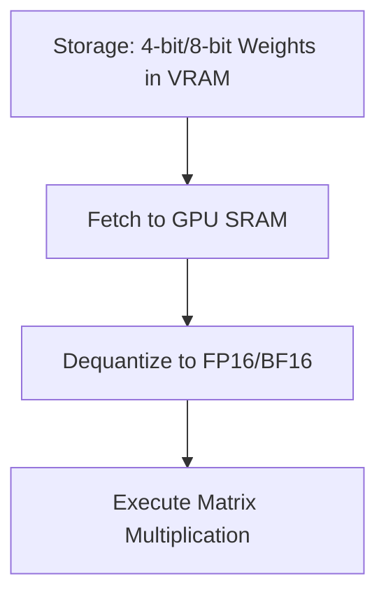

# Dynamic Quantization on-the-fly (Inference/Forward Pass)

[← Back to README](../README.md)

## Introduction
Dynamic Quantization on-the-fly allows weight parameters to be stored in highly compressed formats (4-bit/8-bit) on disk and in memory, but dequantizes them at runtime to high precision before compute.

## How it Works
During the forward pass, compressed weights are fetched from GPU VRAM and dynamically dequantized into FP16/BF16 inside SRAM registers to perform the matrix multiplication.

## Significance
- Massively reduces memory usage for model storage and loading.
- Limits memory-bandwidth bottlenecks at the expense of computational overhead.
