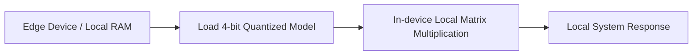

# Edge Device Decentralized Intelligence (Local LLM Serving)

[← Back to README](../README.md)

## Introduction
Edge Device Decentralized Intelligence enables private, offline execution of Large Language Models directly on consumer laptops, mobile devices, and embedded nodes.

## How it Works
Quantization reduces the memory footprint of foundation models (e.g. Llama-3) to fit in standard system RAM or Apple Silicon unified memory without calling cloud APIs.

## Significance
- Total data privacy.
- Continuous operation without internet connectivity.
