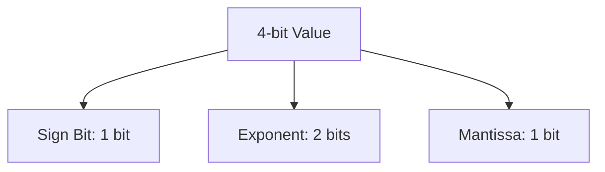

# 4-bit Floating-Point (FP4) Variant

[← Back to README](../README.md)

## Introduction
The 4-bit Floating-Point (FP4) variant uses uniform floating-point representations (such as E2M1 or E1M2) to quantize models, enabling direct compute compatibility with low-precision execution units.

## How it Works
FP4 structures the bits into sign, exponent, and mantissa components.

## Significance
- Supported natively by modern hardware architectures (e.g. NVIDIA Blackwell, OCP MX standards).
- Speeds up matrix multiplication by eliminating dynamic quantization/de-quantization overhead.
