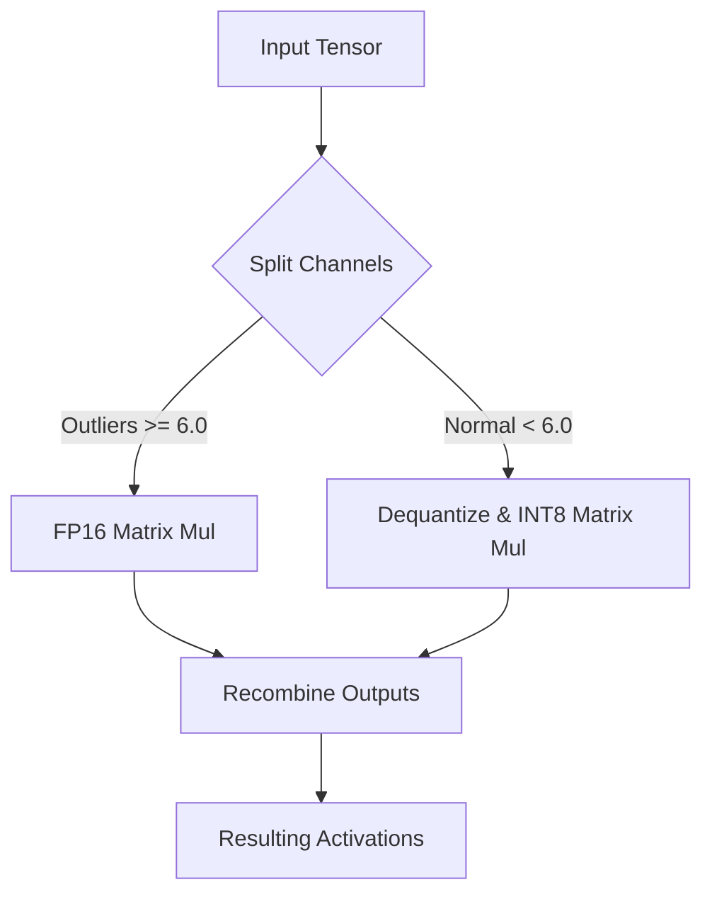

# Vector-Wise Outlier Separation Era (LLM.int8())

[← Back to README](../README.md)

## Introduction
The Vector-Wise Outlier Separation Era represents the foundational breakthrough in executing large language models under 8-bit precision without losing accuracy. Introduced by Dettmers et al. (2022), it addresses the issue of systemic outlier dimensions in activations that occur as models scale past 6.7B parameters.

## How it Works
The core mechanism isolates high-magnitude outlier feature dimensions and processes them in 16-bit floating-point (FP16), while the remaining 99.9% of normal features are quantized and processed in 8-bit integers (INT8).

## Significance
- Enables zero-degradation inference for LLMs on consumer-grade hardware.
- Avoids the accuracy degradation typical of standard integer quantization.
