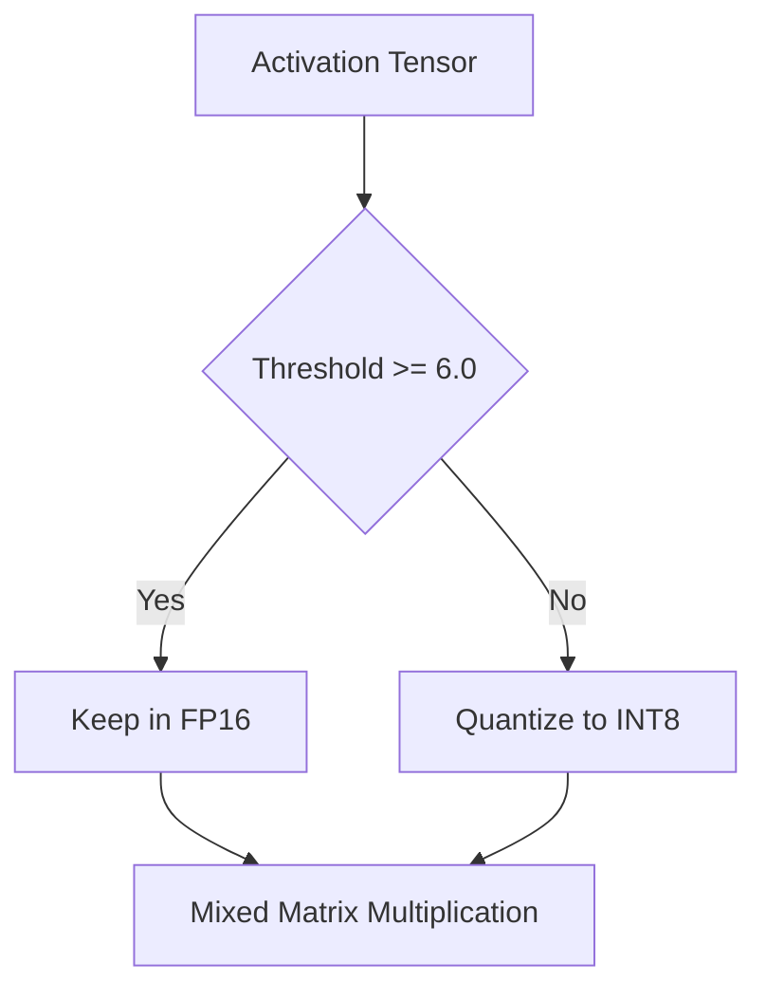

# LLM.int8() (Mixed-Precision 8-bit) Variant

[← Back to README](../README.md)

## Introduction
The LLM.int8() variant implements mixed-precision 8-bit matrix multiplication. It segregates outlier channels that have values exceeding a threshold (typically 6.0) from the main tensor.

## How it Works
The activation outlier coordinates are kept in 16-bit float formats, while the standard coordinates are scaled and quantized to 8-bit integers.

## Significance
- Prevents accuracy loss in model reasoning.
- Transparently integrates into Hugging Face transformers.
