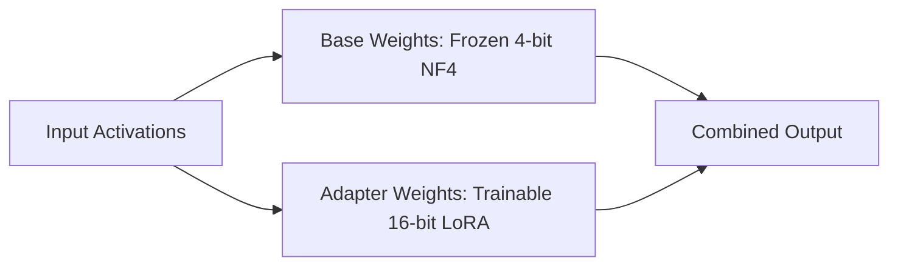

# Consumer-Grade Local Fine-Tuning Hubs (LoRA / QLoRA)

[← Back to README](../README.md)

## Introduction
BitsAndBytes enables developers to run parameter-efficient fine-tuning (PEFT) tasks on consumer-grade hardware. By loading foundation weights in 4-bit NF4 format, memory requirements drop exponentially.

## How it Works
The model weights are frozen in 4-bit, and a small set of trainable parameter adapters (LoRA weights) are added and updated in high precision (FP32/FP16).

## Significance
- Standardizes local development on 8GB to 24GB GPUs.
- Accessible fine-tuning via frameworks like Axolotl, Unsloth, and Hugging Face PEFT.
