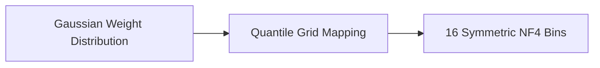

# 4-bit NormalFloat (NF4) Variant

[← Back to README](../README.md)

## Introduction
The 4-bit NormalFloat (NF4) is an information-theoretically optimal non-uniform quantization data type designed specifically for normally distributed neural network weight parameters.

## How it Works
NF4 defines quantization bins based on quantile functions such that each bin has an equal number of expected parameters.

## Significance
- Higher information density than standard uniform INT4 or FP4.
- Outperforms standard 4-bit integer types without requiring additional training adjustment.
