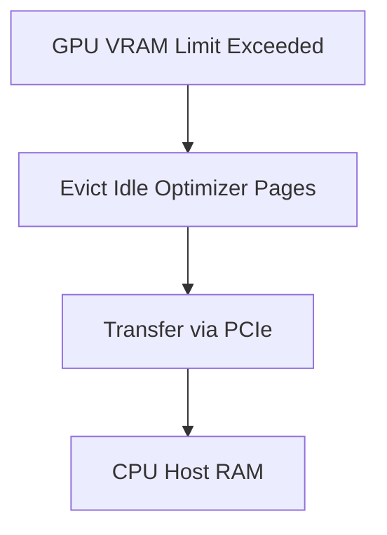

# Paged Optimizers (Unified Memory Swapping)

[← Back to README](../README.md)

## Introduction
Paged Optimizers prevent GPU Out-of-Memory (OOM) errors during parameter-efficient fine-tuning (PEFT) tasks. They swap optimizer states dynamically to CPU RAM over PCIe when memory usage peaks.

## How it Works
Using CUDA Unified Memory, the system intercepts memory allocations. When memory overflows, page-level transfers migrate idle state files to host memory.

## Significance
- Guarantees successful training of large models without OOM crashes.
- Maximizes utilization of available hybrid GPU-CPU systems.
