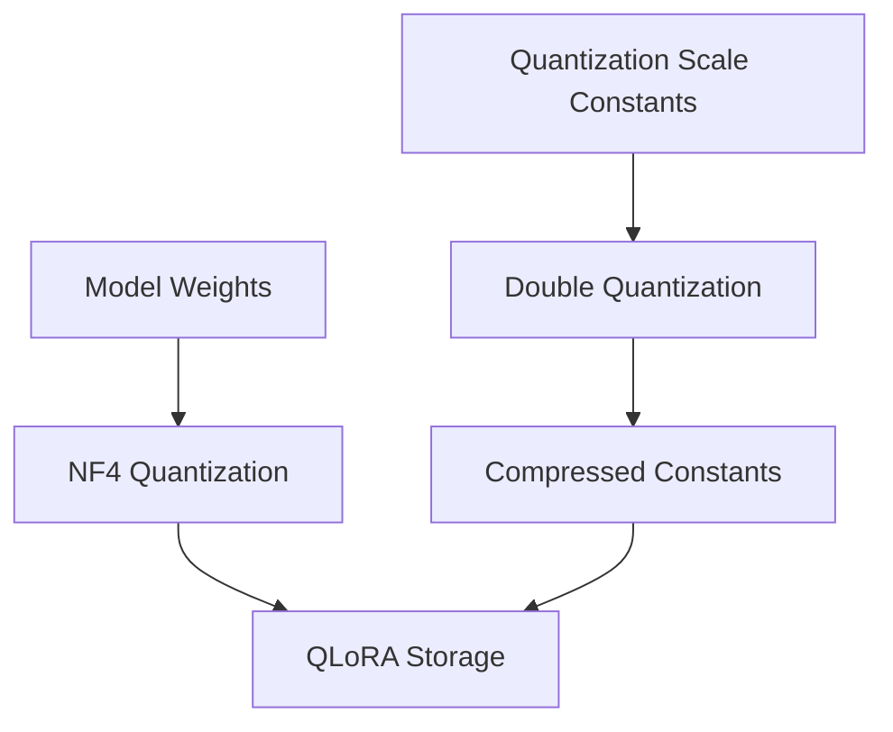

# 4-bit NormalFloat & Quantization Double Play (QLoRA)

[← Back to README](../README.md)

## Introduction
Introduced in QLoRA (Dettmers et al., 2023), this technique enables fine-tuning of massive models (e.g., 70B parameters) on a single 48GB GPU block. It combines an information-theoretically optimal data type (NF4) with Double Quantization.

## How it Works
1. **NF4 Quantization:** Custom data type designed specifically for normally distributed model weights.
2. **Double Quantization:** Quantizes the quantization constants themselves, saving additional VRAM.

## Significance
- Cuts down memory footprint of weight scales.
- Saves roughly 0.37 bits per parameter on average.
