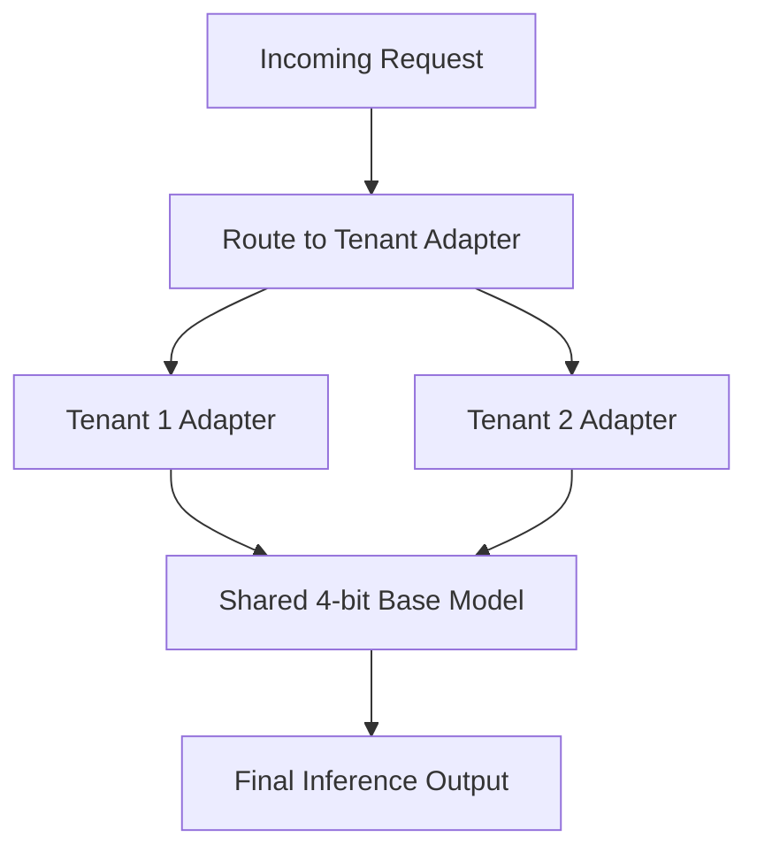

# Multi-Tenant SaaS Foundation Serving Hubs

[← Back to README](../README.md)

## Introduction
Multi-Tenant SaaS Foundation Serving Hubs utilize low-bit model quantization alongside multiple adapter configurations to serve customized inference pipelines concurrently from a single GPU footprint.

## How it Works
The massive base model remains loaded in 4-bit representation in VRAM. Dynamic requests route activations through specialized downstream adapter weights.

## Significance
- Significantly reduces infrastructure hosting costs.
- Enables scalable, multi-tenant serving models.
