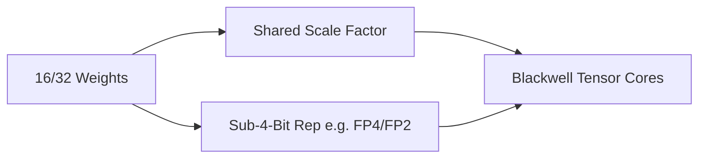

# Native Sub-4-Bit & Fused Floating-Point Era

[← Back to README](../README.md)

## Introduction
The Native Sub-4-Bit & Fused Floating-Point Era is the state-of-the-art advancement utilizing hardware features like NVIDIA Blackwell architecture Tensor Cores to support natively executed low-precision formats such as FP4 and FP2.

## How it Works
Using block-based microscaling (MX) formats where a block of elements (typically 16 or 32) shares a scaling factor, allowing native GPU scaling without runtime software dequantization delays.

## Significance
- Enables 2x throughput compared to FP8.
- Natively accelerated on newer hardware.
